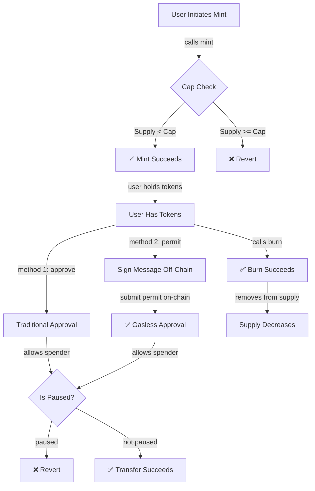
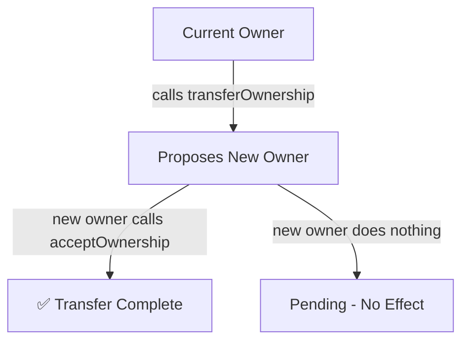

# BestToken Flow

This page visualizes how BestToken processes minting, burning, transfers, approvals, and ownership changes.

## Token Lifecycle

## How It Works

### Minting

Only the owner can mint tokens. Before tokens are added to supply, the cap is checked:

- If current supply + amount > cap: **transaction reverts**
- If current supply + amount ≤ cap: **tokens are minted successfully**

### Transfers

When a user transfers tokens, two checks run:

1. **Pausable check** — Is the contract paused? If yes, revert. If no, continue.
2. **Allowance check** — Does the spender have permission? If yes, transfer succeeds.

### Approvals

Two ways to approve spending:

**Traditional `approve()`:**
- User sends a transaction to the blockchain
- Costs gas (requires ETH)

**Permit (ERC2612):**
- User signs a message off-chain (no blockchain call needed)
- Someone else submits the signed message on-chain
- User doesn't need ETH at all

### Burning

Any token holder can burn their own tokens:

- Call `burn(amount)`
- Tokens removed from circulation
- Supply decreases permanently

## Ownership Management

### Two-Step Transfer

Ownership transfer requires acceptance:

1. Current owner calls `transferOwnership(newAddress)`
2. New owner must call `acceptOwnership()` to accept
3. If new owner doesn't call it, transfer stays pending (no risk of accident)

This prevents mistakes like typos when entering the new owner address.

## Summary

BestToken combines five OpenZeppelin extensions:

| Extension | Feature |
|-----------|---------|
| **Capped** | Fixed supply limit |
| **Burnable** | Users can remove tokens from circulation |
| **Pausable** | Owner can freeze all transfers (emergency only) |
| **Permit** | Gasless approvals via signatures |
| **Ownable2Step** | Safe ownership transfer with confirmation |

All checks run in sequence during `_update()`. If any fails, the transaction reverts.